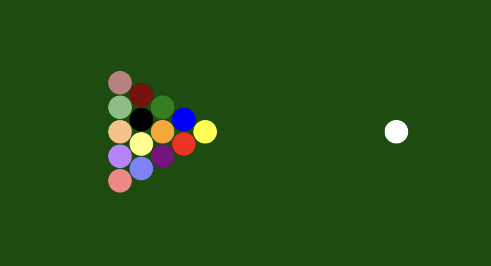

# Animation projects
A series (I hope) of animation practices

Learning with [Ten Minute Physics](https://matthias-research.github.io/pages/tenMinutePhysics/index.html)

### [Gravity simulation](https://raw.githack.com/astoriama/Fun_Animation/main/planets.html) 

Created planets as balls that experience different gravity on a dark blue canvas.

### [Pool Table](https://raw.githack.com/astoriama/Fun_Animation/main/billiard.html) 

Simulated pool table where white ball can be controlled to hit other balls.